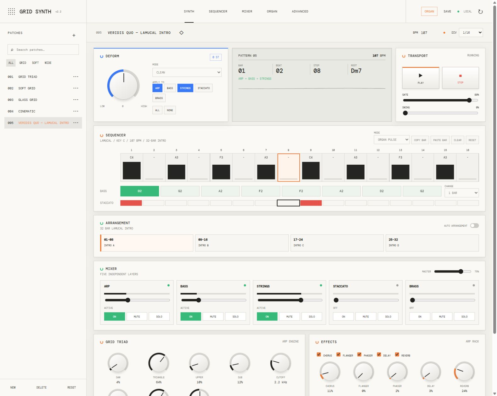
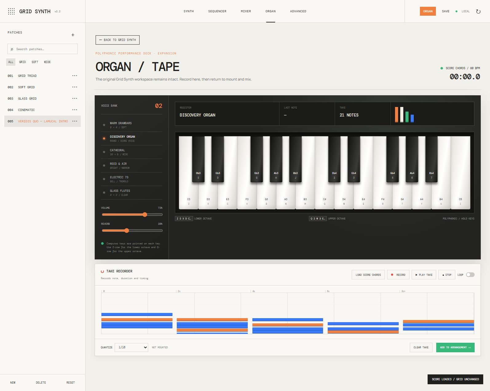

# Grid Synth

Sintetizador musical interactivo para navegador con secuenciador, patches, mezclador, efectos y un órgano polifónico grabable.



## Presentación

Grid Synth combina una estación de síntesis modular con una interfaz clara inspirada en hardware musical. Permite construir patrones, mezclar cinco capas independientes, modificar el carácter del sonido y tocar un órgano polifónico sin instalar software adicional.

La aplicación funciona completamente en el navegador mediante Web Audio API. Los patches, ajustes y tomas se guardan localmente.

## Sobre el proyecto

Grid Synth es uno de los primeros proyectos que comparto aquí. Lo desarrollo como hobby y como espacio de experimentación, por lo que puede contener errores y todavía tiene mucho margen de mejora.

La idea inicial nació del deseo de crear una experiencia musical y visual inspirada en el universo digital de *Tron*.

## Funciones

- Sintetizador de cinco capas: arpegio, bajo, cuerdas, staccato y brass.
- Secuenciador de 16 pasos y arreglos multipista.
- Presets editables, controles de sonido y efectos.
- Preset armónico inspirado en la estructura de *Veridis Quo*.
- Banco polifónico con 14 instrumentos: órganos, pianos, pianos eléctricos y timbres híbridos.
- Teclado desplazable por cinco zonas, desde C1–C3 hasta C5–C7.
- Interpretación mediante ratón o teclado físico.
- Grabación de tomas, reproducción en loop y cuantización.
- Montaje de tomas del órgano dentro del arreglo principal.
- Persistencia local mediante `localStorage`.

## Órgano y grabación



La expansión ORGAN incluye 14 registros —desde órganos y pianos suaves hasta pianos metálicos y voces híbridas—, dos octavas visibles y cinco zonas de interpretación. El grabador conserva nota, duración y timing; las tomas pueden reproducirse en loop, cuantizarse y añadirse al arreglo principal.

## Ejecutar localmente

La aplicación no requiere compilación ni dependencias.

```bash
python -m http.server 4173
```

Después abre `http://127.0.0.1:4173/`.

También se puede abrir `index.html` directamente, aunque un servidor local ofrece un comportamiento más consistente entre navegadores.

## Controles del órgano

- Fila inferior: `Z S X D C V G B H N J M`
- Fila superior: `Q 2 W 3 E R 5 T 6 Y 7 U I`
- `RECORD`: inicia o detiene una toma.
- `PLAY TAKE`: reproduce la toma actual.
- `ADD TO ARRANGEMENT`: convierte la toma en un clip del secuenciador.

## Tecnología

HTML, CSS, JavaScript y Web Audio API. No utiliza frameworks ni servicios externos durante la ejecución.

## Compatibilidad

Requiere un navegador moderno compatible con Web Audio API. El audio se activa después de la primera interacción del usuario, siguiendo las políticas habituales de reproducción de los navegadores.

